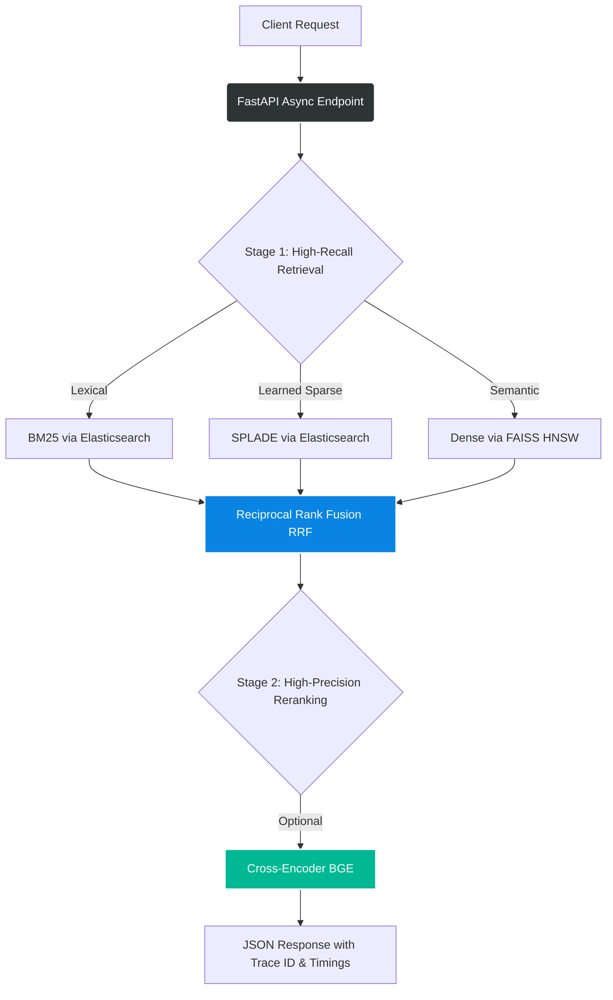

# Hybrid Retrieval RAG System


A production-grade, GPU-accelerated hybrid retrieval system built on the SciFact dataset from the BEIR benchmark. It combines exact lexical matching (BM25), learned sparse expansion (SPLADE), and semantic dense retrieval (FAISS) using Reciprocal Rank Fusion (RRF), followed by domain-appropriate cross-encoder reranking.

Built from scratch with a strict focus on production patterns: explicit dependency injection, structured distributed tracing, circuit-breaker resilience, and containerized GPU-accelerated serving.

---

## Table of Contents

- [System Architecture](#system-architecture)
- [Features & Highlights](#features--highlights)
- [Prerequisites](#prerequisites)
- [Quick Start (Reproducible Setup)](#quick-start-reproducible-setup)
- [API Usage](#api-usage)
- [Evaluation Results](#evaluation-results)
- [Tech Stack](#tech-stack)
- [Project Structure](#project-structure)
- [Design Rationale & Trade-offs](#design-rationale--trade-offs)
- [Troubleshooting](#troubleshooting)
- [Roadmap](#roadmap)
- [Acknowledgements](#acknowledgements)
- [License & Contributing](#license--contributing)

---

## System Architecture

The system follows a classic, highly scalable three-stage retrieval architecture:



## Features & Highlights

- **Hybrid Fusion**: Score-free RRF combines incompatible retrieval methods—unbounded BM25 scores, dot-product SPLADE scores, and cosine dense scores—robustly.
- **Production Resilience**: Circuit breakers prevent cascading failures. If Elasticsearch goes down, the system gracefully degrades to dense-only retrieval.
- **Observability**: Every query generates a `trace_id` and logs exact millisecond timings per retrieval step, with automatic warnings if the 200 ms latency budget is exceeded.
- **Zero Cold-Start Latency**: Heavy models (SPLADE, Dense) are pre-warmed during the FastAPI lifespan startup phase.
- **Async/Sync Bridging**: Uses `asyncio.to_thread()` to run synchronous, GPU-bound retrieval in background threads, preventing FastAPI event-loop blocking.

## Prerequisites

### Hardware

| Resource | Requirement | Notes |
|----------|-------------|-------|
| RAM | 16 GB recommended | 8 GB minimum with smaller batch sizes |
| GPU | NVIDIA GPU with 8 GB+ VRAM | Tested on RTX 5050; CPU-only mode works but SPLADE/dense encoding will be significantly slower |
| Disk | ~5 GB free space | For datasets, model weights, and indexes |

### System Software

| Tool | Version | Purpose |
|------|---------|---------|
| Python | 3.10+ | Local runtime for data ingestion scripts |
| Docker Engine | 24.0+ | Containerization |
| Docker Compose | 2.20+ | Multi-container orchestration |
| NVIDIA Container Toolkit | latest | Required for GPU passthrough to Docker |

> **Note:** Developed and tested on WSL2 (Ubuntu 22.04). Keep the project on the native Linux filesystem (`/home/...`), not the Windows-mounted path (`/mnt/c/...`), for optimal Docker volume I/O performance.

## Quick Start (Reproducible Setup)

### 1. Clone and Install Dependencies

```bash
git clone <your-repo-url>
cd rag-hybrid-retrieval

# Create and activate a local virtual environment
python3 -m venv venv
source venv/bin/activate

# Install PyTorch with CUDA 13.0 support FIRST (required for RTX 5050/Blackwell)
pip install torch==2.13.0 --index-url https://download.pytorch.org/whl/cu130

# Install remaining dependencies
pip install -r requirements.txt
```

### 2. Download the SciFact Dataset

```bash
mkdir -p data
wget https://public.ukp.informatik.tu-darmstadt.de/thakur/BEIR/datasets/scifact.zip -P data/
unzip data/scifact.zip -d data/
```

### 3. Start Elasticsearch and Build Indices

```bash
# 1. Start Elasticsearch in the background
docker compose up -d elasticsearch

# Wait ~15 seconds for ES to initialize, then verify:
curl http://localhost:9200

# 2. Build and ingest BM25 (Lexical)
python create_bm25_index.py && python ingest_bm25.py

# 3. Build and ingest SPLADE (Learned Sparse)
python create_splade_index.py && python ingest_splade.py

# 4. Build FAISS HNSW Index (Dense)
python create_dense_index.py
```

*(Note: SPLADE and dense encoding will utilize your local GPU and may take a few minutes.)*

### 4. Launch the Production API Stack

Now that the `./data` and `./indexes` directories are populated on your host machine, start the API container. Docker will build the GPU-accelerated image and mount your local data as read-only volumes.

```bash
docker compose up --build -d api
```

The first startup will take 2–3 minutes as the container downloads model weights from Hugging Face and loads them into GPU memory.

### 5. Verify Health

```bash
docker logs rag-hybrid-api
```

## API Usage

The API exposes a single `/search` endpoint. Interactive Swagger UI documentation is automatically available at `http://localhost:8000/docs`.

### Example Request

```bash
curl -X POST "http://localhost:8000/search"      -H "Content-Type: application/json"      -d '{
           "query": "0-dimensional biomaterials show inductive properties",
           "top_k": 3
         }'
```

### Example Response

```json
{
  "results": [
    {
      "doc_id": "43385013",
      "score": 0.0404,
      "title": "Epithelial and mesenchymal subpopulations...",
      "text": "It has been proposed that epithelial-mesenchymal transition..."
    }
  ],
  "trace_id": "f9f7c464-9d5e-47da-8d48-5af30f4c341d",
  "timings": {
    "bm25_search": 6.9,
    "splade_search": 76.4,
    "dense_search": 10.7,
    "fusion": 0.19
  }
}
```

## Evaluation Results

Evaluated on the SciFact test split (300 queries, `top_k=100`). The hybrid approach definitively outperforms any single retrieval method.

| Method | Hit Rate | Recall@100 | Avg Best Rank | nDCG@10 |
|--------|----------|------------|---------------|---------|
| BM25 | 89.0% | 88.5% | 4.51 | 0.6606 |
| SPLADE | 95.0% | 95.0% | 6.66 | 0.7079 |
| Dense | 92.7% | 93.2% | 6.55 | 0.6451 |
| Hybrid (RRF) | 96.3% | 96.2% | 5.12 | 0.7097 |
| + BGE Reranker | 96.3% | 96.2% | 4.92 | 0.7158 |

**Key Finding:** Fusing complementary methods yields better coverage. Domain-appropriate reranking (BGE) improves ranking quality, while mismatched models (MS MARCO) degrade it.

## Tech Stack

| Component | Tool | Rationale |
|-----------|------|-----------|
| Lexical Search | Elasticsearch 8.15 | Industry-standard inverted index with native sparse-vector support |
| Dense Search | FAISS (HNSW) | Purpose-built C++ library for sub-millisecond ANN graph traversal |
| ML Framework | PyTorch 2.13 (CUDA 13.0) | Optimized for Blackwell architecture (RTX 5050) |
| Serving Layer | FastAPI + Uvicorn | Modern async Python web framework with auto-generated OpenAPI docs |
| Infrastructure | Docker Compose | Multi-container orchestration with NVIDIA GPU passthrough |

## Project Structure

```
rag-hybrid-retrieval/
├── configs/           # Centralized YAML configuration and loader
├── data/              # BEIR SciFact dataset (corpus, queries, qrels)
├── indexes/           # FAISS binary index and ID sidecar files
├── ingestion/         # Raw data parsing into typed dataclasses
├── indexing/          # Elasticsearch mapping, FAISS HNSW builder, encoders
├── retrieval/         # BM25, SPLADE, dense search & RRF fusion logic
├── reranking/         # Cross-encoder reranking module
├── evaluation/        # From-scratch IR metrics (nDCG, Recall, MAP)
├── serving/           # FastAPI application, Pydantic models, lifespan warmup
├── tests/             # Unit and integration tests
├── tracing.py         # Structured JSON logging, TraceContext, circuit breakers
├── docker-compose.yml # Multi-container GPU orchestration
└── Dockerfile         # NVIDIA CUDA base image build recipe
```

## Design Rationale & Trade-offs

**Why RRF instead of score normalization?**  
BM25 scores are unbounded, SPLADE scores are dot products, and dense scores are cosine similarities. Normalizing them requires knowing each distribution's min/max per query, which is fragile. RRF ignores raw scores and only looks at rank (`1 / (k + rank)`), making it robust and parameter-light.

**Why separate `SearchResult` and `FusedResult` dataclasses?**  
Even though they share the same fields, the `score` field means completely different things (raw similarity vs. accumulated RRF score). Separate types prevent silent semantic bugs where downstream code accidentally thresholds an RRF score (`0.03`) as if it were a cosine similarity (`0.8`).

**Why explicit dependency injection instead of singletons?**  
Loading the FAISS index or Elasticsearch client inside the retrieval functions would cause batch scripts to trigger hundreds of redundant model loads. By injecting pre-loaded instances via function arguments, the caller controls the lifecycle.

**Why sync core with async API?**  
FAISS is a synchronous C++ library, and PyTorch's core operations run on a synchronous CUDA stream. Trying to force them into an async/await paradigm is a trap. Instead, the FastAPI layer is fully async, but explicitly bridges to the sync core using `asyncio.to_thread()`. This keeps the math simple while allowing the web server to handle concurrent connections without blocking the event loop.

## Troubleshooting

| Issue | Solution |
|-------|----------|
| **Elasticsearch connection refused** | The container does not auto-restart by default. Run `docker compose up -d elasticsearch` and wait ~15 seconds before retrying. |
| **Out of memory (OOM) on GPU** | With SPLADE, dense, and cross-encoder all loaded, VRAM usage peaks at ~6–7 GB. If you hit OOM during local batch testing, run scripts one at a time instead of in parallel. |
| **Slow Docker I/O** | Ensure your project directory is on the native WSL Linux filesystem (`/home/...`), not the Windows-mounted path (`/mnt/c/...`). |

## Roadmap

- [ ] Add streaming response support for large result sets
- [ ] Implement Redis caching for frequent, identical queries
- [ ] Add Prometheus metrics export for real-time dashboarding
- [ ] Support for custom, domain-finetuned reranking models via config

## Acknowledgements

- **BEIR Benchmark** — for providing the standardized SciFact dataset and evaluation framework.
- **Hugging Face** — for the `transformers` and `sentence-transformers` libraries that make model inference accessible.
- **FAISS** — for the industry-standard approximate-nearest-neighbor library.
- **Elastic** — for the robust, production-grade search engine.

## 🤝 Feedback & Contributions

This is a personal portfolio project built to demonstrate production-grade RAG architecture, but I highly value feedback from the community. 

- **Found a bug or have a suggestion?** Please [open an issue](https://github.com/praveenKumarAmbadi/hybrid-rag-retrieval). 
- **Want to contribute?** Pull requests are welcome! For major changes, please open an issue first to discuss what you would like to change.
- **Questions or networking?** Feel free to reach out to me on [LinkedIn](https://www.linkedin.com/in/ambadi-praveen-3b6779191/) or via [email](mailto:ambadipraveenkumar490@gmail.com).

## 📜 License

Distributed under the MIT License. See the [LICENSE](LICENSE) file for more information.

Please ensure your code passes the existing test suite and adheres to the project's strict separation of concerns and dependency injection patterns.
